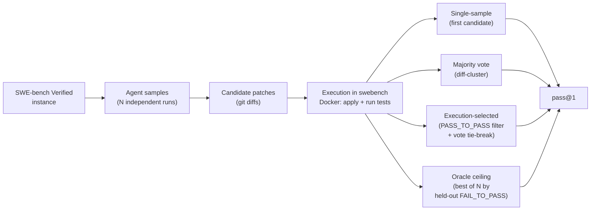
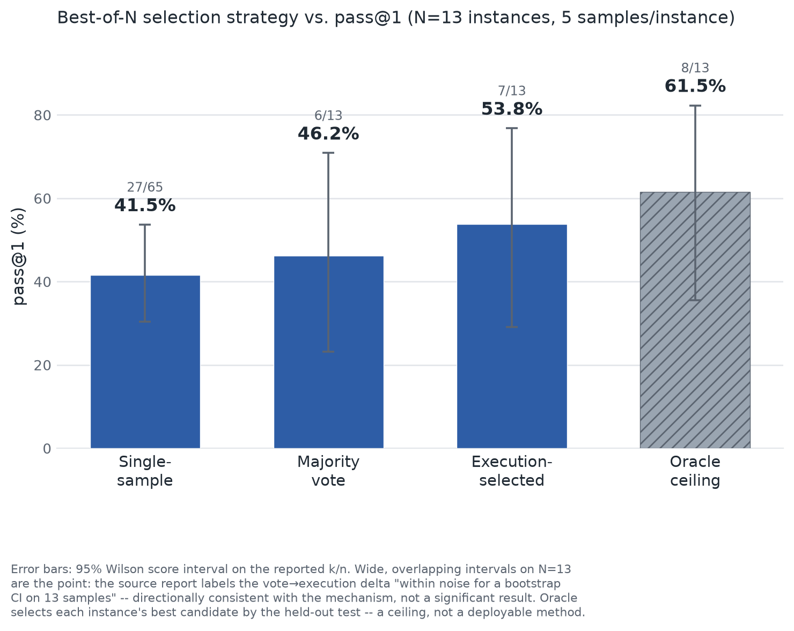

# Execution-Guided Candidate Selection for Coding Agents on SWE-bench Verified

A small eval harness that measures a coding agent's real pass@1 on a SWE-bench Verified
subset by **actually running the tests** — not an LLM judge, not a leaderboard number quoted
from a vendor. It then asks a narrower question: given N candidate patches for the same
issue, can you pick the right one *without* the held-out test, using only the repository's
own regression suite? On the N=13 subset measured here, execution-guided selection recovers
about half the gap between naive majority-vote and the oracle ceiling.

This repository is a sanitized, public extract of a private evaluation harness. Host names,
internal tooling, and the private agent under test have been replaced with configurable,
BYO-agent equivalents (see [Reproduce](#reproduce)); the method, the code, and the numbers
are unchanged.

## Abstract

Selecting a good patch out of several LLM-generated candidates ("best-of-N") is usually done
by majority vote over the generated diffs. This project measures, on real hardware and a real
grader, whether **execution feedback** — running each candidate against the target
repository's own pre-existing test suite (`PASS_TO_PASS`), *never* the task's held-out
`FAIL_TO_PASS` test — beats plain majority vote as a selection signal. On a validated 13-instance
SWE-bench Verified subset with N=5 samples per instance, single-sample pass@1 is 41.5%,
diff-cluster majority vote lifts it to 46.2%, and execution-guided selection reaches 53.8% —
closing roughly half of the 15.3-point gap to the 61.5% oracle ceiling (the best of the 5
samples, selected by the held-out test itself — a ceiling, not a deployable result). The
result is directional, not statistically significant at N=13; it is reported with that caveat
attached, as it was originally measured.

## Method



1. **Instance.** One task from SWE-bench Verified: a repo, a base commit, an issue description,
   a gold patch, and a hidden `FAIL_TO_PASS` / `PASS_TO_PASS` test split.
2. **Sample.** The agent runs N independent times on the same instance (checkout, edit, `git
   diff`). The agent **never sees `test_patch`** — only the problem statement.
3. **Grade.** Every candidate is applied and graded by the official [SWE-bench
   harness](https://github.com/princeton-nlp/SWE-bench) in Docker: does `FAIL_TO_PASS` now
   pass, and does `PASS_TO_PASS` still pass?
4. **Select**, four ways, all fed by the same N graded candidates:
   - **Single-sample** — pass@1 over every (instance, sample) pair, no selection at all.
   - **Majority vote** — cluster candidates by the edits they actually make (ignoring hunk
     offsets, index hashes, and context lines — `bestofn.cluster_key`), pick a representative
     of the largest cluster. Never touches test results.
   - **Execution-selected** — first filter to candidates whose `PASS_TO_PASS` run clean (no
     regressions against the repo's own existing suite), then majority-vote among the
     survivors (`exec_select.select_by_execution`). This is the one signal a deployed agent
     could compute itself, because it never reads the held-out test.
   - **Oracle ceiling** — resolved if *any* of the N candidates passes `FAIL_TO_PASS`. This
     peeks at the answer key; it is a ceiling on what a perfect selector could achieve, not a
     deployable method.
5. **Report pass@1** for each strategy over the instance subset, with the small-N caveat
   attached to every number.

## Results

| Strategy | pass@1 | Resolved | Source |
|---|---|---|---|
| Single-sample | 41.5% | 27 / 65 (instance, sample) pairs | `docs/exec-selection-result.md`, `docs/reliability-report.md` §5 |
| Majority vote (diff-cluster, previous deployable) | 46.2% | 6 / 13 instances | `docs/exec-selection-result.md`, `docs/reliability-report.md` §5 |
| **Execution-selected (deployable)** | **53.8%** | **7 / 13** instances | `docs/exec-selection-result.md` |
| Oracle pass@k ceiling | 61.5% | 8 / 13 instances | `docs/exec-selection-result.md`, `docs/reliability-report.md` §5 |

N=13 curated, arm64-grading-biased SWE-bench Verified instances (`subset-v2.txt`), 5 repos
(django, flask, pylint, requests, pytest), N=5 samples/instance. All figures are exactly as
reported in the source documents above — see [Limitations](#limitations) for the caveats that
travel with them.



**+7.7pp over majority vote — about half the 15.3pp gap that vote was leaving on the table**
(`docs/exec-selection-result.md`). The error bars in the figure are 95% Wilson score intervals
on the reported k/n for each strategy (27/65, 6/13, 7/13, 8/13) — not a claim of significance,
a visualization of how little N=13 constrains these estimates. The source report is explicit
that the vote→execution delta is "well inside noise for a bootstrap CI on 13 samples" — see
[Limitations](#limitations).

## Worked example: `psf__requests-1921`

This is the single instance that motivated the whole selector change
(`docs/exec-selection-result.md`):

- 5 independent agent samples were drawn for this instance; **3 resolved, 2 did not** — a
  clear majority resolves.
- The regression vector (from harvested `PASS_TO_PASS` results) was `[True, True, True, False,
  False]`: the two *failing* candidates were textually **identical** to each other, while the
  three *correct* fixes were **diverse** diffs from one another.
- **Diff-cluster majority vote picked the wrong answer.** Because the two wrong candidates were
  identical, they formed the single largest cluster; the three correct-but-mutually-different
  fixes each landed in their own smaller cluster. Majority vote is popularity among candidates,
  not correctness — and it lost even though a literal majority of samples were correct.
- **Execution-guided selection got it right.** Both failing candidates broke the repo's own
  `PASS_TO_PASS` suite; the selector filtered them out and picked among the three (still
  diverse) survivors — landing on index 0, which resolves.

A second instance, `pylint-dev__pylint-4970`, also changed which candidate got selected (index
0 → 1) — but neither candidate actually resolves, so it didn't move the aggregate number
(`docs/exec-selection-result.md`).

## Limitations

- **N=13, and the headline delta is a single instance flipping (6/13 → 7/13).** That is "well
  inside noise for a bootstrap CI on 13 samples" — directionally consistent with the mechanism
  (identical-wrong-candidates-outvote-diverse-correct-ones is a real failure mode of majority
  vote, demonstrated concretely above), but not a statistically significant result
  (`docs/exec-selection-result.md`).
- **Curated subset, not the official 500, not leaderboard-comparable.** Instances were chosen
  with an arm64-grading bias (pure-Python repos with arm64 wheels) across 5 repos; every number
  here carries that subset caveat (`docs/report.md`, `docs/M2-validation.md`).
- **Partial regression coverage.** Regression verdicts (`PASS_TO_PASS`) were available for 55 of
  65 candidates (46 clean, 9 regressed); the other 10 had no usable grader report (errored or
  empty patch) and were passed to the selector as `None`, where it degrades to plain majority
  vote rather than discarding the candidate — the selector was running partly blind on ~15% of
  candidates (`docs/exec-selection-result.md`).
- **The regression signal and the oracle label share a grading pass.** The execution-selected
  result was computed by re-scoring an *existing* graded run's harvested `PASS_TO_PASS` data
  (`scripts/harvest_pass_to_pass.py`) — no agent or grader was re-run for this measurement.
  Reading only `PASS_TO_PASS` (never `FAIL_TO_PASS`) is what keeps the selector non-leaky, but a
  real deployment would have to run the repo suite itself against wall-clock and compute budget
  that this measurement didn't have to pay (`docs/exec-selection-result.md`).
- **arm64 grading is real but constrained.** SWE-bench Verified's official evaluation images are
  `x86_64`-only. Grading on an arm64 host works via one-time `qemu`/`binfmt` x86 emulation
  (correct, but slow — one-time per-image pulls of 1–2GB, and parallel emulated Docker builds
  are what overloaded an earlier x86 grader host); an x86 Docker host is a faster alternative
  when reachable. Neither path scales to the full 500-instance set as configured here
  (`docs/arm64-grading.md`, `docs/reliability-report.md` §2).
- **No temperature control on sampling.** Candidate diversity across the N samples relies on the
  agent's default sampling stochasticity; the harness does not set an explicit temperature, so
  per-candidate results vary run-to-run (`docs/reliability-report.md` §6).

## Reproduce

This harness is **BYO agent, BYO Docker grader host** — it never shipped a specific agent
implementation; it ships an adapter (`spark_swe_eval.agent.HARNESS_ARMS`) plus a default
command template you point at your own agent CLI.

```bash
python3 -m venv .venv && source .venv/bin/activate
pip install -e ".[dev]"
pytest                              # 112 tests, no network/Docker required
ruff check .                        # style
```

Environment variables (all default to `localhost`, i.e. everything running on one box):

| Variable | Used for | Default |
|---|---|---|
| `AGENT_HOST` | SSH host the coding agent runs on | `localhost` |
| `GRADER_HOST` | SSH host running Docker + the swebench harness | `localhost` |
| `AGENT_CMD` | Command that invokes your agent (`{AGENT_CMD} run --model <arm> <prompt>`) | `agent` |

Running an actual instance end-to-end additionally requires:

- Your own coding agent CLI on `$AGENT_HOST`'s `PATH` (or a `HARNESS_ARMS` entry in
  `agent.py` — `dsh`, `openclaude`, and `opencode` adapters ship as worked examples of the
  pattern), reachable over SSH.
- Docker + the [`swebench`](https://github.com/princeton-nlp/SWE-bench) package installed on
  `$GRADER_HOST`, reachable over SSH; see `docs/arm64-grading.md` if that host is arm64.

```bash
spark-swe-eval m0 --host "$GRADER_HOST" django__django-11099   # validation gate: gold≈100%, empty≈0%
spark-swe-eval bestofn --arm <your-model-tag> --subset subset-v2.txt \
    --host-agent "$AGENT_HOST" --host-grader "$GRADER_HOST" --n 5 --selector exec
```

`--selector vote` reproduces the majority-vote number; `--selector exec` reproduces the
execution-selected number. `rescore` re-scores an already-graded run directory under
`select_by_execution` without re-running anything (how the headline result in this repo was
originally produced — see `docs/exec-selection-result.md`).

## Citation

```bibtex
@software{schaefer2026executionguided,
  author = {Schaefer, Carter},
  title = {Execution-Guided Candidate Selection for Coding Agents on SWE-bench Verified},
  year = {2026},
  url = {https://github.com/Cschaefer732/execution-guided-selection},
  license = {MIT}
}
```

## License

MIT — see [LICENSE](LICENSE).
